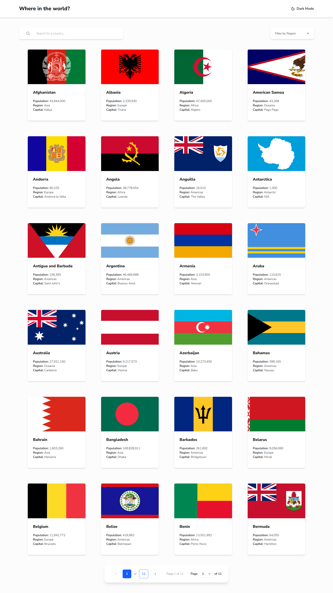
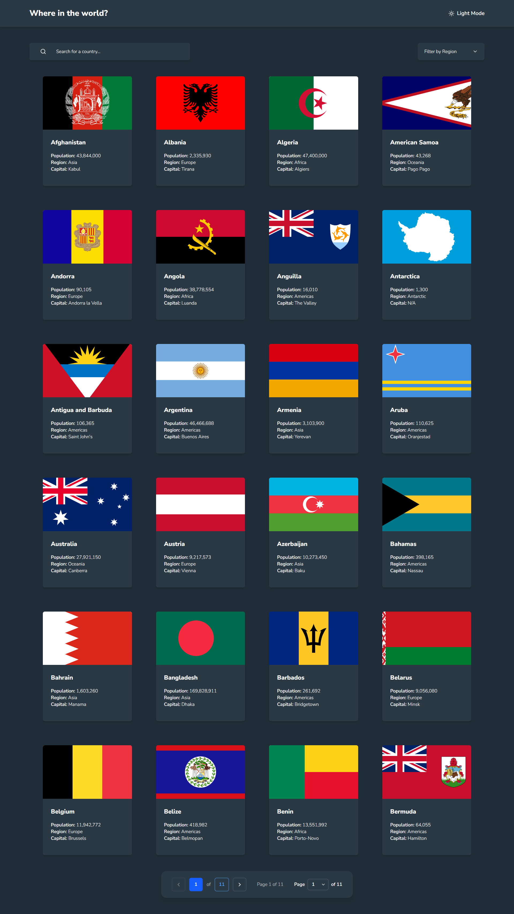

# Where in the world? — REST Countries API with color theme switcher

A responsive React application that lists the countries of the world, lets you search and filter them, and shows detailed information for each one. It is my solution to the [REST Countries API with color theme switcher](https://www.frontendmentor.io/) challenge on Frontend Mentor.




## Table of contents

- [Features](#features)
- [Links](#links)
- [Built with](#built-with)
- [Getting started](#getting-started)
- [Project structure](#project-structure)
- [What I learned](#what-i-learned)
- [Troubleshooting](#troubleshooting)
- [Author](#author)
- [Acknowledgements](#acknowledgements)

## Features

- Browse all countries with their flag, population, region and capital
- Search a country by name
- Filter countries by region
- Paginated list (24 countries per page) with previous / next buttons and a page selector
- Detail page for each country (native name, sub region, top level domain, currencies, languages)
- Clickable border countries to navigate from one country to its neighbours
- Light and dark themes, saved between visits
- Loading, error and "not found" states
- Responsive layout, from mobile to desktop
- Accessible markup: labels, `aria` attributes, keyboard focus styles and reduced-motion support
- Countries are cached in the browser for one hour to limit API requests

## Links

- Solution URL: [GitHub repo](https://github.com/Ismaellerakotoson/countries-app.git)
- Live Site URL: [Live demo](https://countries-app-73ls.vercel.app/)

## Built with

- [React](https://react.dev/) and [TypeScript](https://www.typescriptlang.org/)
- [Vite](https://vite.dev/)
- [React Router](https://reactrouter.com/) for client-side routing (`/` and `/country/:name`)
- [Tailwind CSS](https://tailwindcss.com/) (v4) with a class-based dark mode
- [Lucide React](https://lucide.dev/) for icons
- [REST Countries API](https://restcountries.com/) (v5)
- React Context API for the theme and the countries data

## Getting started

### Prerequisites

- A recent LTS version of [Node.js](https://nodejs.org/)
- A free REST Countries API key (see below)

### Installation

```bash
git clone https://github.com/Ismaellerakotoson/countries-app.git
cd countries-app
npm install
```

### Get an API key

The REST Countries API (v5) requires a key.

1. Create a free account on [restcountries.com](https://restcountries.com/) and generate an API key.
2. In your account's **API Keys** page, add `localhost` to the allowed origins of the key (hostname only, without `http://` or a port).
3. Copy the example environment file and put your key in it:

```bash
cp .env.example .env.local
```

On Windows (Command Prompt), use `copy .env.example .env.local` instead. Then edit `.env.local`:

```
VITE_RESTCOUNTRIES_KEY=your_api_key_here
```

`.env.local` is ignored by git and must never be committed.

### Run the project

```bash
npm run dev
```

Open the address shown in the terminal (usually `http://localhost:5173`).

### Other scripts

```bash
npm run build     # type-check and create a production build
npm run preview   # preview the production build locally
```

> **Note on the API key.** This is a client-side application, so the key is included in the JavaScript sent to the browser. Restrict it to your own domains with the allowed origins setting, and keep the free plan limits in mind (see Troubleshooting).

## Project structure

```
src/
├── components/
│   ├── layout/       # Layout, Header, ThemeToggle
│   ├── countries/    # SearchBar, RegionFilter, CountriesList, CountryCard,
│   │                 # CountryDetails, BorderCountries
│   └── ui/           # BackButton, Loader, ErrorMessage, Pagination
├── context/          # CountriesContext, ThemeContext
├── pages/            # Home, CountryPage, NotFound
├── services/         # countriesApi (fetching, pagination and caching)
├── types/            # TypeScript types
├── utils/            # formatPopulation, getNativeName
├── router.tsx
├── App.tsx
└── main.tsx
```

## What I learned

- Setting up routes with React Router and reading URL parameters with `useParams`.
- Sharing data across pages with the Context API and fetching it only once.
- Calling a paginated REST API with `async` / `await`, and handling loading and error states.
- Reducing API usage with a time-limited cache in `localStorage`.
- Deriving data (search, filter, pagination) from state instead of storing it.
- Building a dark / light theme with Tailwind CSS and a custom `dark` variant.
- Respecting the rules of hooks, and writing accessible components.
- Dealing with real-world API issues: a deprecated API version, API keys, CORS and rate limits.

## Troubleshooting

- **CORS error in the console.** Check that `localhost` is listed in the allowed origins of your key. If it is, you may have hit the rate limit (20 requests per 10 seconds): wait about 30 seconds and reload once.
- **Nothing loads and the API returns 403.** The free plan allows 1,000 requests per month, and the account is frozen when the limit is exceeded. The one-hour cache is there to avoid this. In development, React Strict Mode runs effects twice, so avoid reloading repeatedly.
- **The environment variable is `undefined`.** The name must start with `VITE_`, the file must be at the project root, and the dev server must be restarted after creating it.
- **Stale data after changing the `Country` type.** Clear the `countries-cache-v1` key in your browser's local storage, or change the `CACHE_KEY` constant in `src/services/countriesApi.ts`.

## Author

- Frontend Mentor — [@Ismaellerakotoson](https://www.frontendmentor.io/profile/Ismaellerakotoson)
- GitHub — [@Ismaellerakotoson](https://github.com/Ismaellerakotoson)

## Acknowledgements

- Challenge and design by [Frontend Mentor](https://www.frontendmentor.io/).
- Country data from [REST Countries](https://restcountries.com/).